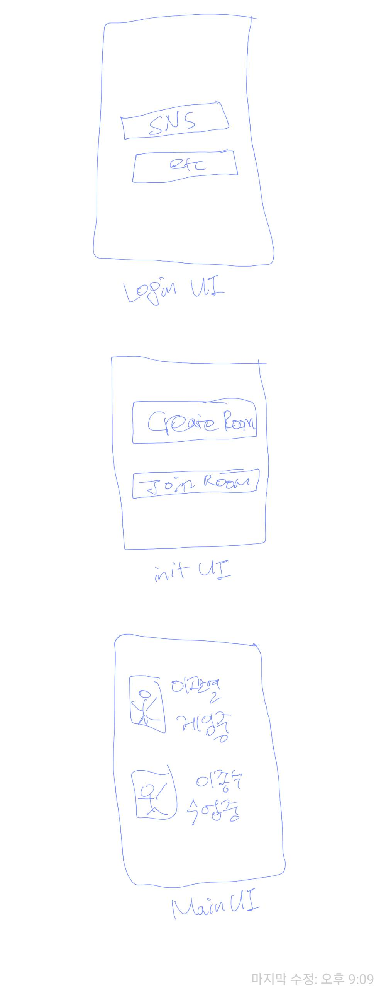

# EMO

##

## EMO Usecase Diagram

##

## Tool

- vs-code : plant UML
  preview command in vscode : mac(command+d), window(alt+d)

---

## Appendix

- discusion google sheet : [link](https://docs.google.com/spreadsheets/d/1JYJ-wbss9vnaaS77AAHqQ08EVIpDW-L3ClLRErYGx7E/edit#gid=0)

---

## Scenario

- room is destroyed when all members out.

---

## DB

- RoomDB
  |UNIQUE_ROOM_ID|MEMBERS_UUID|
  |:---|:---|
  | UUID_1 | MEMBER_1_UUID, MEMBER_2_UUID|
  | UUID_2 | MEMBER_3_UUID, MEMBER_4_UUID|

- MemberDB
  |MEMBER_UUID|INFO|
  |:---|:-|
  | MEMBER_1_UUID | { NAME:JONGSOO, STATUS:WORKING }|
  | MEMBER_1_UUID | { NAME:GWANYEOL, STATUS:STUDING }|

---

## UI

- LoginUI : Create ID or Sign in
- InitUI : Create room or Join room (user can in only one room)
- MainUI : Can checkek members state who are associated same room. and Can change my status.

